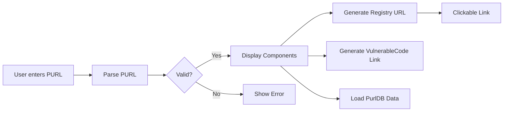
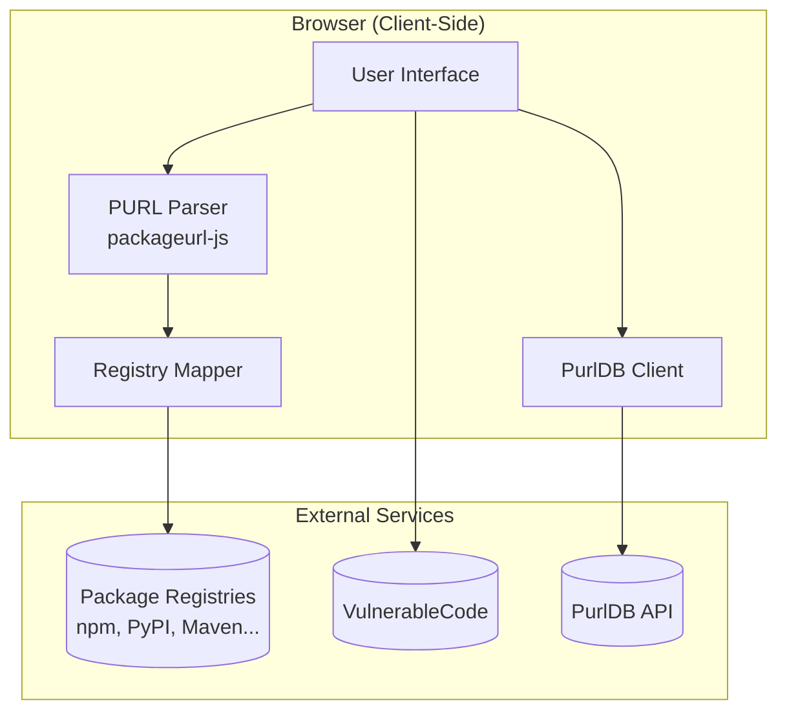
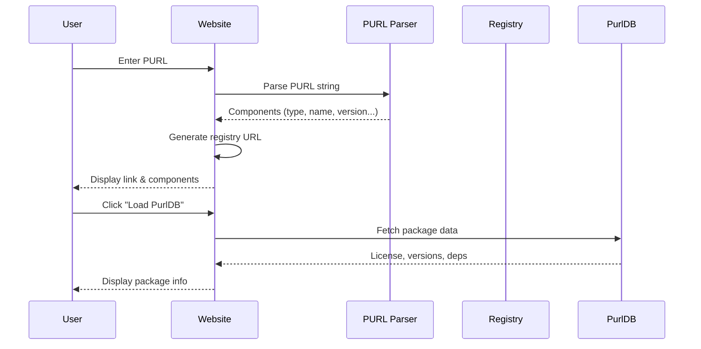

# Package URL Viewer

A static website that parses [Package URLs (PURLs)](https://github.com/package-url/purl-spec) and links to their registries.

**Live Demo**: [s-celles.github.io/package-url-viewer](https://s-celles.github.io/package-url-viewer/)

## What is a PURL?

A Package URL (PURL) is a standardized way to identify software packages across ecosystems. For example:
- `pkg:npm/lodash@4.17.21` → npm package
- `pkg:pypi/requests@2.28.0` → PyPI package
- `pkg:maven/org.apache.commons/commons-lang3@3.12.0` → Maven artifact

## Features

- **Parse PURLs** - Enter any PURL and see its components (type, namespace, name, version)
- **Registry Links** - Get direct links to the package on its official registry
- **VulnerableCode Integration** - Check for known vulnerabilities
- **PurlDB Integration** - View license, versions, metadata, and dependencies
- **Shareable URLs** - Share links with pre-filled PURLs via query parameters
- **Embeddable Badges** - Copy markdown badges for your README
- **Works Offline** - Fully client-side, no backend required

## How It Works



## Architecture



## Data Flow



## Supported Package Types

All 38 official PURL types are supported:

| Type | Registry | Type | Registry |
|------|----------|------|----------|
| npm | npmjs.com | pypi | pypi.org |
| maven | search.maven.org | cargo | crates.io |
| gem | rubygems.org | nuget | nuget.org |
| golang | pkg.go.dev | docker | hub.docker.com |
| github | github.com | composer | packagist.org |
| conda | anaconda.org | hex | hex.pm |
| cocoapods | cocoapods.org | pub | pub.dev |
| swift | swiftpackageindex.com | hackage | hackage.haskell.org |
| *...and 22 more* | | | |

## Usage

### Via Web Interface

1. Visit [s-celles.github.io/package-url-viewer](https://s-celles.github.io/package-url-viewer/)
2. Enter a PURL in the input field
3. Click "Parse" or press Enter
4. Click the registry link or explore PurlDB data

### Via URL Parameter

Share pre-filled links:
```
https://s-celles.github.io/package-url-viewer/?purl=pkg:npm/lodash@4.17.21
```

## Development

### Prerequisites

- Node.js 18+
- Hugo Extended (for building)

### Setup

```bash
# Install dependencies
npm install

# Run tests
npm test

# Start development server
npm run dev

# Build for production
npm run build
```

### Project Structure

```
site/
├── assets/js/          # TypeScript source
│   ├── main.ts         # Main application
│   ├── purl-parser.ts  # PURL parsing logic
│   ├── registry-mapper.ts  # Registry URL generation
│   ├── purldb.ts       # PurlDB API client
│   └── purldb-display.ts   # PurlDB UI rendering
├── layouts/            # Hugo templates
└── static/css/         # Stylesheets
tests/                  # Vitest test files
```

## License

MIT
